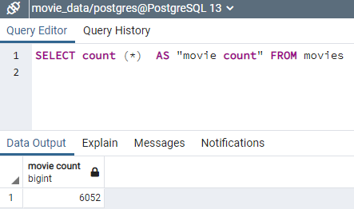
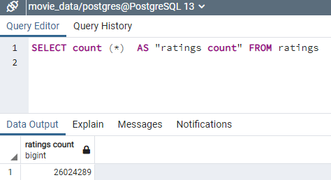

# Movies-ETL
Module 8

## Overview

For this project, movie data from multiple sources is extracted, transformed and loaded into a PostgreSQL database in an automated function.  Code was refactored from the movies.ipynb and each deliverable builds on the previous one.

### Summary

The first deliverable takes in three data files and creates three separate data frames.  
  - ETL_function_test.ipynb
  
The second deliverable extracts and transforms a wikipedia json file to be merged with other movie data.
  - ETL_clean_wiki_movies.ipynb
  
The third deliverable extracts and transforms kaggle meta data and ratings data in .csv format.  All data is then merged into a data frame.
  - ETL_clean_kaggle_data.ipynb
  
 The fourth deliverable incorporates the output from the previous deliverables and imports it into a PostgreSQL database.
  - ETL_create_database
  - Two tables are created; movies and ratings (see total rows below)
  
                                 
       
